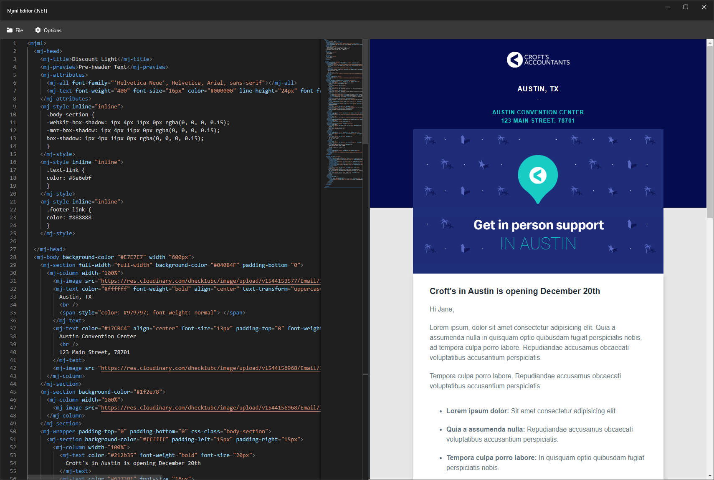

# Mjml App for Mjml.Net
A slim version of the official [MJML App](https://mjmlio.github.io/mjml-app/) which is built on top of the blazingly-fast unofficial port of [MJML 4](https://mjml.io/) (by [MailJet](https://www.mailjet.com/)) to [.NET 6](https://dotnet.microsoft.com/).

<b>IMPORTANT:</b> IF YOU ARE USING MJML FOR NODE PLEASE USE THIS [VERSION](https://mjmlio.github.io/mjml-app/).

## Features
- Real-time editor
- Create, Open and Save MJML Templates

## What is MJML?

`MJML` is a markup language created by [Mailjet](https://www.mailjet.com/) and designed to reduce the pain of coding a responsive email. Its semantic syntax makes the language easy and straightforward while its rich standard components library shortens your development time and lightens your email codebase. MJML’s open-source engine takes care of translating the `MJML` you wrote into responsive HTML.

## Appreciations
Once again, it's good to share some appreciation to the projects that make `MJML.NET App` possible.

- [MJML](https://github.com/mjmlio/mjml)
- [MJML.NET (Stable)](https://github.com/SebastianStehle/mjml-net)